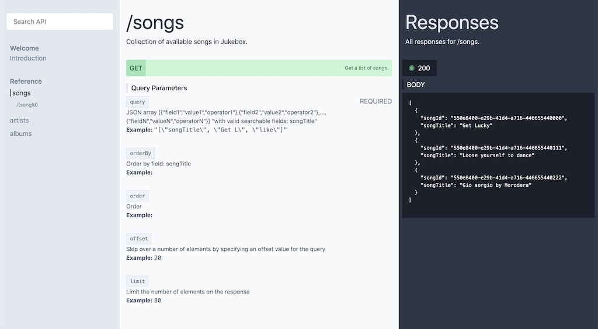

# LeanAPI



LeanAPI is a tool that allows you to build beautiful (arguably) documentation for multiple API definition languages. 

### Supported languages
* RAML 1.0
* OAS 2.0

## Installation

You can install leanAPI either as a local dependency for your project or globally if you just want to use it as a development tool.

**Local installation**  
Run `npm install --save-dev leanapi` within your project to install leanAPI as a dependency. You can your CI system generate the documentation by running:

```
./node_modules/.bin/leanapi path/to/api/definition.json
```

Deploy the resulting docs folder and you have continuously updated documentation!

**Global installation**  
Run `npm install -g leanapi` to install leanAPI as a globally available tool on your machine. You can then use it through your terminal by running:

```
leanapi path/to/api/definition.json
```

## Options

**Output folder**  
You can specify the ouptput folder by doing the following:
```
leanapi -o docs path/to/api/definition.json
```
*Or:* `--output`  
*Default:* `api-docs`

**Development server**  
You can let leanAPI spin up a development server that will allow you to check/develop your api docs without letting it generate the actual files.

It will start watching the definition path, so any change to a file within that folder will automatically update your docs without you having to refresh.

Usage:
```
leanapi -s path/to/api/definition.json
```
*Or:* `--serve`

**Development server port**  
When serving from the development server you can specify the port you want leanAPI to use:

```
leanapi -s -p 8080 path/to/api/definition.json
```

*Or:* `--port`  
*Default:* `9876`

**Help**  
You can prompt the help screen by running:
```
leanapi -h
```

*Or:* `--help`

## License
The LeanAPI source code is licensed under the [MIT License](https://github.com/bastuijnman/leanapi/blob/master/LICENSE).